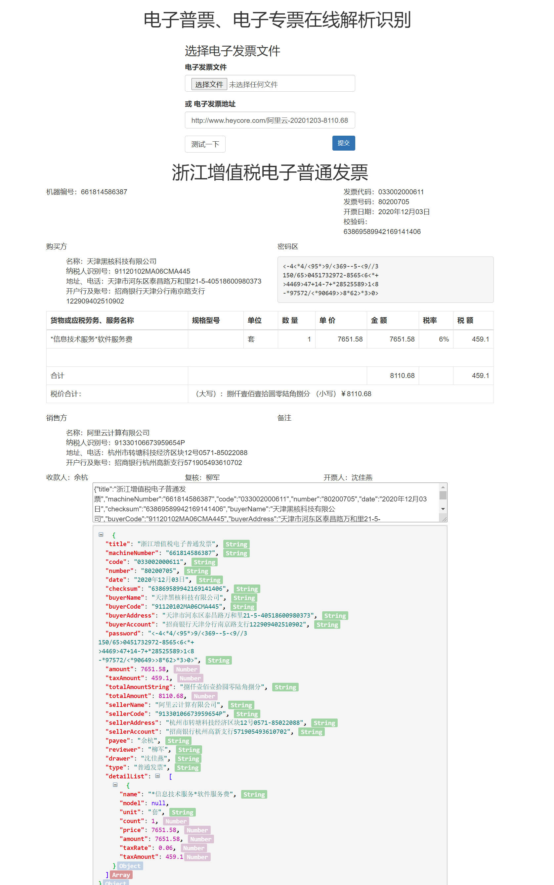

# 电子发票识别

### 简介

电子发票识别，可识别大部分地区的电子普票 电子专票 文件类型支持 pdf ofd

笔记本电脑测试单线程6秒100张pdf电子发票

在线识别页面 http://www.heycore.com/invoice.html

### 效果预览

pdf识别部分参考改进了 https://github.com/fantasyxxj/einvoice 改进前16秒单线程解析100张票

pdf识别非ocr识别，识别原理：按常规票面布局位置定位与文字匹配双重规则对票面文字解析

ofd识别原理：读取ofd文件中的描述文件

### 待完成

1. 按地区票种分层、分模板识别，提升识别准确度
2. 全电发票识别